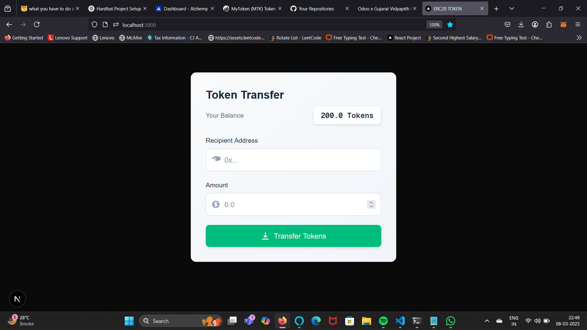

# ERC20 Token Project

This project demonstrates a basic ERC20 token implementation using Hardhat for smart contract development, Ethers.js for interacting with the Ethereum blockchain, and Next.js for the frontend.

## Technologies Used

- **Solidity**: For writing smart contracts.
- **Hardhat**: Development environment for Ethereum.
- **Ethers.js**: Library for interacting with the Ethereum blockchain.
- **Next.js**: React framework for building the frontend.
- **Tailwind CSS**: For styling the frontend.



## Project Structure

- `contracts/`: Contains the Solidity smart contracts.
- `scripts/`: Deployment scripts.
- `test/`: Test files for the smart contracts.
- `frontend/`: Next.js frontend application.

## Getting Started

### Prerequisites

- Node.js and npm installed.
- MetaMask extension for interacting with the Ethereum network.

### Installation

1. Clone the repository:
    ```shell
    git clone https://github.com/your-repo/erc20-token.git
    cd erc20-token
    ```

2. Install dependencies:
    ```shell
    npm install
    cd frontend
    npm install
    cd ..
    ```

3. Compile the smart contracts:
    ```shell
    npx hardhat compile
    ```

### Deployment

1. Deploy the smart contract to a local network:
    ```shell
    npx hardhat node
    npx hardhat run scripts/deploy.js --network localhost
    ```

2. Deploy the smart contract to Sepolia testnet:
    ```shell
    npx hardhat run scripts/deploy.js --network sepolia
    ```

### Running Tests

Run the tests to ensure everything is working correctly:
```shell
npx hardhat test